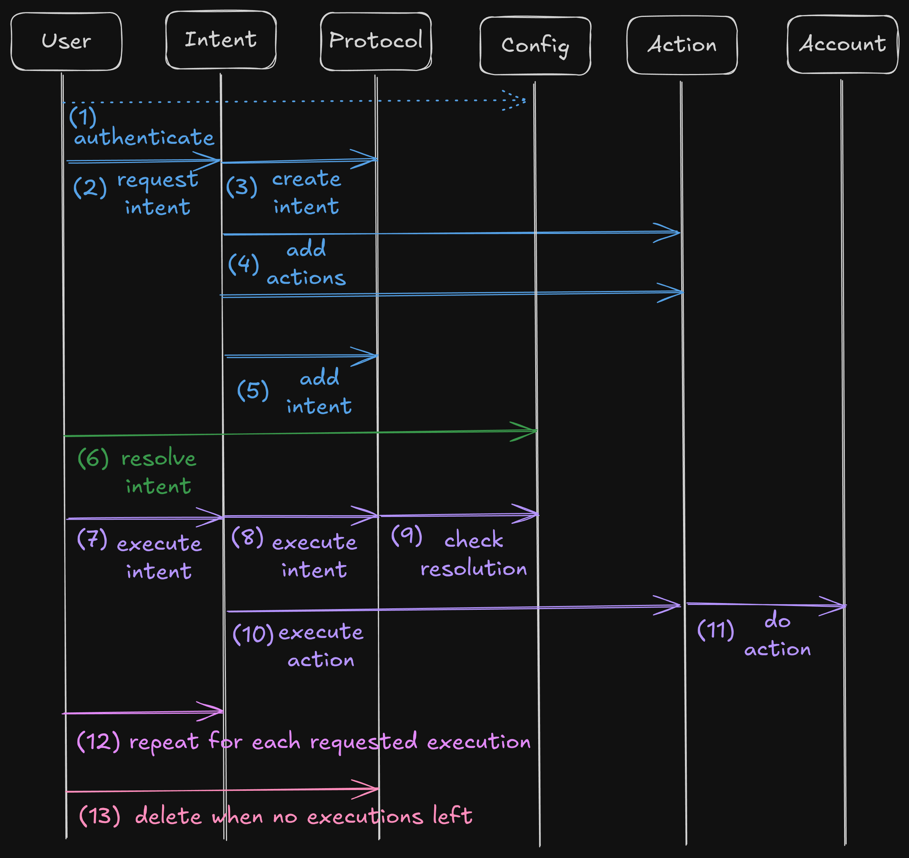

# account.tech - Move Framework for Smart Accounts

## Project Overview

This project aims to provide the robust foundations developers need to build secure and user-friendly experiences on Sui.

### Abstract

We're establishing a new object standard on Sui that transforms basic addresses into powerful Smart Accounts. This extension of Sui accounts provides native support for all standardized Sui objects and essential built-in features, freeing developers to focus on innovation rather than rebuilding core functionality.

While Smart Accounts provide a secure execution layer, they remain fully customizable at the application level. Each project can define new [Smart Account types](https://github.com/account-tech/move-registry) to implement its own rules and features while inheriting standardized security measures and base functionality. This unique approach combines enterprise-grade reliability with unlimited flexibility.

Our standardized interfaces simplify object management, offering developers an intuitive way to leverage Sui's object-centric model. The system operates on an intent-based architecture where actions must pass through configurable resolution rules before execution. This creates a powerful yet flexible framework where Move developers can freely define new actions and intents, either for specific applications or as reusable libraries.

### Design Principles

Our framework is built on four core design principles that guide our development and ensure we create a robust, flexible system for smart accounts on Sui.

#### Modularity

Our smart accounts are designed as shared objects with a unified interface that handles core logic and manages the intent creation and execution flow. The beauty lies in the flexibility of the account rules and intent resolution, which can be configured to fit specific needs.

Configurations are versatile structs that can be customized to fit any requirement. By default, we offer Multisig as well as coin-based and NFT-based DAO configurations. These preset options define specific rules and parameters such as thresholds, roles, members, and weights in the case of the Multisig, or quorum, vote rules and governing asset for DAOs.

The true power of our system is its adaptability – any type of configuration with custom rules can be implemented without necessitating a core protocol upgrade.

#### Compatibility

Smart Accounts seamlessly interact with owned objects, mirroring the functionality of standard Sui accounts. account.tech goes a step further by providing custom interfaces for effortless interaction with standard Sui objects and straightforward integration with custom objects. Our roadmap includes support for all known objects on Sui, along with extended capabilities for them.

Beyond basic compatibility, our interfaces introduce important policies missing from Sui's core framework. These include essential security features like upgrade time locks and currency supply controls, providing built-in protection that traditionally requires custom development.

Front-end applications leveraging our protocol, such as our Multisig platform, can utilize the Move interfaces provided for each object type. This enables the creation of user-friendly experiences that abstract away the complexities of managing multiple objects from different packages.

#### Extensibility

account.tech serves as fundamental security infrastructure for the Sui ecosystem, built on principles of modularity and extensibility that enable seamless integration at any level of complexity.

On-chain organizations can immediately secure their assets and operations through our ready-to-use applications like Multisig and DAO platforms, requiring zero additional code. For development teams, our SDK provides programmatic access to these capabilities, allowing them to extend functionality within their applications and backends without direct blockchain interaction.

More advanced users can deeply integrate with our protocol, embedding custom actions and intents directly into their smart contracts through our comprehensive interfaces. This flexibility also enables innovators to create entirely new configurations to build secure, intuitive platforms atop our infrastructure while maintaining enterprise-grade security standards.

#### Trustless

Smart Accounts explicitly declare and upgrade package dependencies allowed to modify their state. This approach ensures a trustless environment by preventing the execution of unauthorized or potentially malicious code without the account members’ consent.

### Smart Account

Smart Accounts represent an advanced form of Sui accounts. They are designed with flexible and customizable ownership rules and rich functionality based on intents.

An intent is an on-chain operation that is executed in multiple steps:
- a user creates an intent to do an action
- the intent is resolved according to the Smart Account's `Config`
- when the conditions are met, the intent can then be executed by anyone

Each Smart Account type has a specific `Config` and its associated intents have a specific `Outcome`.

The `Config` is a struct that contains the "parameters" or "ownership rules" for the Smart Account. It can be anything you want, from a simple threshold to a voting system, to a recovery mechanism.

The `Outcome` is a struct that holds the status of the intent resolution, according to the `Config`. It can be the votes that have been cast, the approvals that have been given, the amount of coin that has been spent, etc.

### Features

- **On Chain Registration**: Create a User profile object to track your smart accounts on-chain. Send and receive invites to join smart accounts on-chain.  We use SuiNS to display a username and profile picture on the front-ends. 
- **Configuration**: Set up the Smart Account's configuration based on the type of Smart Account. For each proposal, define an expiration epoch and schedule one or more execution times, making the intent recurring. Explicitly add and migrate to new dependencies to benefit from new features built by the Good Move team and the community.
- **Granular Control**: Assign roles to addresses to define specific permissions for actions and users.
- **Asset Management**: Manage and send coins or any other object type owned by an Account in a natural way. Containerize and spend coins with Vaults, and NFTs with Kiosks. Transfer and de/list NFTs from/to the Account's Kiosks.
- **Payments and Vestings**: Pay people by issuing recurring transfer intents and create vestings. Cancel the payment or vesting if you made a mistake or if it hasn't been claimed.
- **Currency Management**: Lock a TreasuryCap and enable/disable the minting and/or burning of Coins. Update its CoinMetadata. Send and airdrop minted coins.
- **Access Control**: Define any action in your own module and securely manage its execution via the Account. Check out the [examples](./package/examples/sources/). Secure your Caps access within the Account.
- **Package Upgrades**: Lock your UpgradeCaps in your Account to enforce agreement on the code to be published. An optional time-lock built-in policy is provided by default to protect your users.
- **Interact with dApps**: Easily interact with dApps on Sui that are integrated to the Smart Account. Stake, Swap, Lend your assets, and more. (TODO)

## Architecture

### Framework Packages

The Move code has been designed to be highly modular. There are currently 3 packages but we plan to add more, including external protocol integrations. 

#### Extensions

Since anyone can create modules to extend the protocol, smart accounts have to explicitly declare which package (dependency) is authorized to modify its state. For this reason, there is an `AccountExtensions` package which is managing an `Extensions` object tracking allowed packages and their different versions. 

Due to the immutable nature of packages, Accounts must also explicitly migrate to the new version of a package they wish to use. So unlike on other chains, malicious code can't be added to a smart account without the account members' consent.

Each Account can opt-in to authorize "unverified deps" which are packages that are not listed in the `Extensions` object. This is useful for developers who don't need their dependency to be globally accessible.

#### Protocol

The `AccountProtocol` package is handling the `Account` logic and the intent process. The `Account` object encapsulates 3 custom types managing its dependencies, metadata (incl. name) and intents.

The metadata and dependencies can only be accessed mutably via an action defined in this same package and that must be wrapped into an intent. The intents can only be handled within the module that defines the Account `Config` type. This ensures that the Account state can't be modified without proper intent resolution.

Dynamic fields can freely be added to the `Account` object by any module. It is recommended to use custom types for the keys to avoid conflicts and enforce permissioned access.

#### Actions

The `AccountActions` package defines a collection of actions that corresponds to unit on-chain operations. They can not be used as is but are meant to be used as building blocks to compose intents.

Based on these actions, multiple intents are defined and can be used with any `Account` `Config` type.

### Modules Structure

Actions and intents are defined in different modules to achieve a better separation of concerns.

#### Actions

Actions are "low-level". It defines a basic operation that can not be executed by itself, it needs to be composed with other actions. (e.g. `Transfer` can't be executed directly as we need something to transfer. It can be used with a `Withdraw` action to receive and transfer an object from the Account.)

Developers can define their own actions in their own modules.
 
#### Intents

Intents are "high-level". They are composed of one or more actions that are executed in the order they are stacked.

Developers can define their own intents using actions defined in different modules, at the condition they are added to the account dependencies.

### Objects handling

An `Account` can possess and interact with objects in two different ways:

- Using transfer to object (tto), we replicated the behavior of classic Sui accounts, enabling Accounts to receive, own and interact any kind of object.
- Using dynamic fields, we can attach managed assets to the `Account` object. This allows us to abstract, secure and provide granular control to many processes such as upgrading packages, managing a Coin, handling access control, etc.

## Usage

### Intent Flow

1. User must authenticate by getting an `Auth` instance in the account config module.
2. Then an empty `Outcome` can be initialized for the intent.
3. An intent can then be created via `request_intentname()` functions within intent modules.
4. The intent must be resolved by validating the `Outcome` as defined in the account config module. (e.g. approving the intent to reach a threshold for a multisig)
5. Once the conditions are met, the intent is executed by calling the `execute_intent()` function defined in the config module. An `Executable` hot potato ensuring proper execution is returned.
6. Actions are executed sequentially by passing the `Executable hot potato` to `execute_intentname()`.
7. Optionally, the `Executable` hot potato must be destroyed via `complete_intentname()` (if it hasn't been consumed during execution).

### Integration

Anyone can define custom actions and intents in their own package or separate library! Please refer to the [examples](./examples/) for some use cases. You can also create new smart account types in [move-registry](https://github.com/account-tech/move-registry).

Create a new intent by defining a `request_intent()` function that will instantiate an `Intent` and add the actions of your choice to it. Then write a `execute_intent()` function that will execute the actions according to their logic. Add a `complete_intent()` function to destroy the actions and the `Executable` hot potato if it can't be done during the precedent step (if you need to loop over `execute_intent()` for instance).

Create new actions by defining structs with store only ability carrying the data you need. These actions are instantiated via `new_action()` functions that takes a mutable reference to the intent. Then they are executed by calling `do_action()` taking the `Executable` hot potato as argument. After execution, the intent is destroyed which returns an `Expired` hot potato wrapping the actions. Each action must be destroyed in its own module by calling `delete_action()`.

### Modules

The project is splitted in multiple packages to improve the security. Indeed, some packages have no external dependency so they are less vulnerable and don't necessitate forced upgrades because of third party packages. 

`AccountExtensions` could be made immutable to guarantee `Extension` can't be compromised.

Furthermore, the `AccountProtocol` shouldn't need to be upgraded since its functionalities will not change except with a major evolution of the protocol. It provides two modules with sensitive actions:

1. **Config**: Enables the modification of the Account Metadata. It also handles the management of the Account dependencies.

2. **Owned**: Manages access to objects owned by the Account, allowing them to be withdrawn through intents. Withdrawn objects can be used in transfers, vestings and anything else.

`AccountActions` consists of several modules, with several actions and intents, each handling different aspects of the smart account functionality:

1. **Access Control**: Lock Caps into the Account and borrow them upon intent execution.

2. **Currency**: Allows creators to lock a TreasuryCap and limit its permissions. Members can mint coins and use them in transfers or payments. Mint can be disabled upon lock.

3. **Kiosk**: Handles the creation of a Kiosk, which is a container for NFTs owned by the Account. The Kiosk module can be used to move NFTs between the Account and other Kiosks. NFTs can listed and delisted from the Kiosk and profits can be withdrawn.

4. **Vestings**: Defines APIs for creating vestings for a Coin that are used in other modules like `owned`, `currency` and `vault`. 

5. **Transfers**: Defines APIs for transferring objects from an Account. These objects are retrieved by withdrawing them from owned, spending them from vault, minting them from currency, or anything else you want to define.

6. **Vaults**: Allows members to open containers for Coins and assign members to them via roles. Coins held there can be transferred, paid and more using the Spend action.

7. **Package Upgrades**: Secure UpgradeCaps by locking them into the Account and set a TimeLock.

## Additional Information

### Considerations

Currently, only the transaction digest is accessible within Move. Since it includes the gas object, we can't use it to execute arbitrary move call via the smart contract multisig.

[A SIP](https://github.com/sui-foundation/sips/pull/37) has been submitted by our team to propose to expose more data from the transaction context on chain. The SIP is currently paused while we explore other potential solutions such as sponsored transactions.

### Contributing

Contributions are welcome! If you have suggestions for improvements or new features, please open an issue or reach out [on Twitter](https://twitter.com/BL0CKRUNNER) before submitting a PR.

### License

This project is licensed under the MIT License - see the [LICENSE](LICENSE) file for details.

